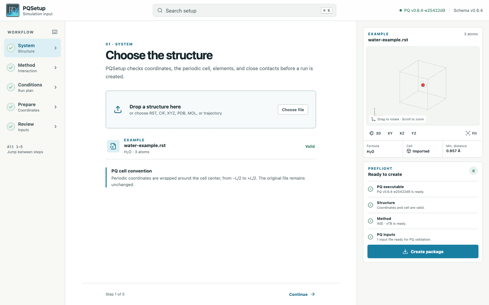

<p align="center">
  
</p>

<h1 align="center">PQSetup</h1>

<p align="center">
  Prepare and validate PQ simulation inputs before a run.
</p>

<p align="center">
  <a href="https://github.com/MolarVerse/PQSetup/actions/workflows/ci.yml"></a>
  
  <a href="LICENSE"></a>
</p>

PQSetup is a local graphical setup tool for
[PQ](https://github.com/MolarVerse/PQ). It checks structures, guides ensemble
and method selection, builds equilibration and sampling plans, and exports
readable inputs with a fail-fast run script.



## Quick start

PQSetup requires Python 3.11 or newer. A PQ installation is recommended but
not required to prepare an input.

```bash
git clone https://github.com/MolarVerse/PQSetup.git
cd PQSetup
python3 -m venv .venv
source .venv/bin/activate
python -m pip install .
pqsetup
```

The interface is bundled with the Python package, so Node.js is not needed to
install or run PQSetup. It opens on `127.0.0.1` and does not submit or run a
simulation.

Check the local PQ installation and available external calculators:

```bash
pqsetup doctor
```

For an executable with a different name or location:

```bash
pqsetup --pq-executable /path/to/PQ
```

The same path can be set with `PQ_EXECUTABLE`.

## PQ compatibility

PQSetup currently targets the stable PQ v0.6.4 input schema. It detects the
selected executable's version and uses PQ's machine-readable CLI when
available:

| PQ command | Used for |
| --- | --- |
| `PQ --capabilities=json` | Version, compiled features, external calculators, defaults, and supported ranges |
| `PQ --validate run.in --format=json --scope=installed` | Authoritative parser and setup validation |

This CLI contract is implemented for the planned PQ v0.7 release in
[PQ pull request #322](https://github.com/MolarVerse/PQ/pull/322). With older
PQ versions, PQSetup keeps local checks active and states when PQ validation
was not run.

## What it prepares

- XYZ and PQ restart structures, including collision and periodic-cell checks.
- Vacuum, NVT, and NPT conditions with the controls supported by PQ v0.6.4.
- QM and molecular-mechanics inputs with calculator availability diagnostics.
- Optional NVT equilibration followed by one or more numbered sampling runs.
- Seeded velocity initialization and optional Gaussian position perturbation.
- `run-eq.in`, `run-01.in` through `run-999.in`, and a `run.sh` launcher.

Exported launchers write logs to `run-logs/` and stop at the first failed or
incomplete PQ run.

## Command line

```bash
pqsetup                              # open the local interface
pqsetup doctor                       # inspect PQ and calculators
pqsetup validate run.in              # check an existing input
pqsetup serve --no-browser           # run without opening a browser
```

Use `--json` with `doctor` or `validate` for machine-readable output.

## Development

Node.js 20 or newer is required only when changing the interface.

```bash
python -m pip install -e ".[dev]"
npm --prefix frontend ci
python -m pytest
npm --prefix frontend test
npm --prefix frontend run build
```

PQSetup is available under the [MIT License](LICENSE).
