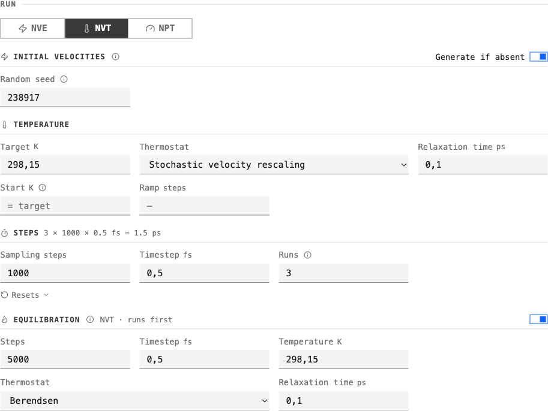
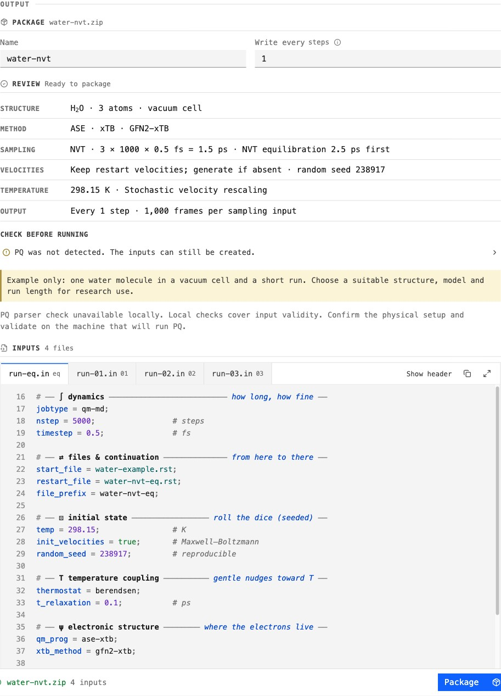

Getting started
===============

Install and open
----------------

.. code-block:: bash

   python3 -m venv .venv
   source .venv/bin/activate
   python -m pip install MolarVerse-PQSetup
   pqsetup

PQSetup opens at ``http://127.0.0.1:8888``. Python 3.11 or newer is required.
PQ and the selected calculator are needed on the execution machine.

To choose another local port or suppress automatic browser opening:

.. code-block:: bash

   pqsetup serve --port 8890 --no-browser

Keep remote servers on loopback and use an SSH tunnel. The direct, VPN, and
compute-node commands are in :doc:`remote-access`.

1. Choose the structure and method
----------------------------------

Import a structure or run folder, confirm its formula, atom count, and cell,
then choose QM or MM and add the method files.

.. figure:: assets/screenshots/workspace.png
   :alt: PQSetup structure, method, and run controls
   :class: pq-workspace
   :align: center

   The included water system uses ASE · xTB in a generated vacuum cell.

2. Define the run plan
----------------------

Choose the ensemble and set the thermodynamic conditions, timestep, sampling
length, chained runs, and optional equilibration.

   This example writes one equilibration input followed by three sampling
   inputs.

3. Review and package
---------------------

Check the summary and every input. Errors block **Package**; warnings remain in
**Review** and in ``pqproject.json``.

   The preview exposes the exact PQ settings before download.

The bundled water system is a short demonstration. A valid package does not
establish model suitability, stability, equilibration, sampling quality, or
convergence. See :doc:`validation` before a research run.

Run the package
---------------

On the machine that has PQ and the selected calculator:

.. code-block:: bash

   pqsetup doctor
   unzip water-nvt.zip -d water-nvt
   cd water-nvt
   pqsetup validate run-01.in
   ./run.sh /opt/pq/bin/PQ

The launcher follows the recorded input order and stops at the first failed or
incomplete run. File transfer and scheduler submission remain under the user's
control; see :doc:`run-packages`.

Next
----

* :doc:`Control map <workflow>`
* :doc:`Validation and scientific limits <validation>`
* :doc:`Compatibility <reference/compatibility>`
* :doc:`Advanced settings <reference/settings>`
