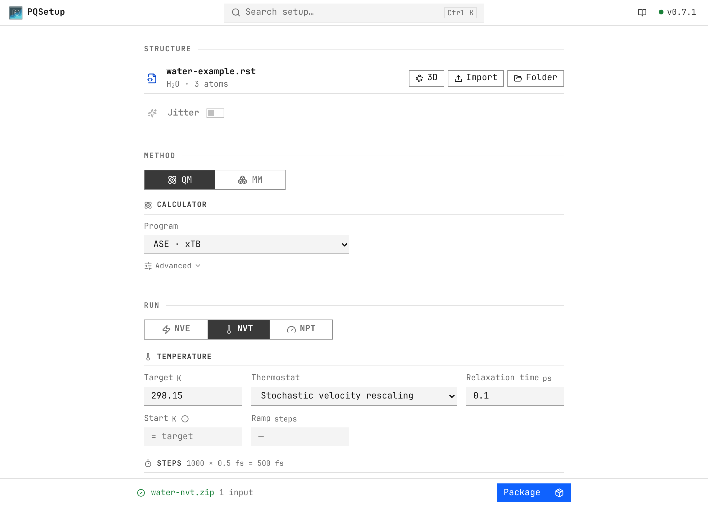

.. _overview:

PQSetup
========

PQSetup prepares and validates simulation inputs for PQ in a local browser
interface. It turns a structure and simulation plan into a portable run package
whose inputs can be inspected before execution.

:doc:`Get started <getting-started>` · :doc:`Build a run <workflow>` ·
:doc:`Validation <validation>` · :doc:`Command line <reference/cli>`

.. note::

   PQSetup is a pre-release project. File and Python interfaces may change
   before 1.0.

Quick start
-----------

PQSetup requires Python 3.11 or newer.

.. code-block:: bash

   python3 -m venv .venv
   source .venv/bin/activate
   python -m pip install MolarVerse-PQSetup
   pqsetup

The interface is included in the Python package. Node.js is not required.

   Structure, Method and Run on one page; the generated inputs follow below.

Documentation
-------------

.. grid:: 1 1 3 3
   :gutter: 2

   .. grid-item-card:: Getting started
      :link: getting-started
      :link-type: doc

      Installation, environment checks, and the first run package.

   .. grid-item-card:: Build a run
      :link: workflow
      :link-type: doc

      Structure, method, run conditions, output, and shortcuts.

   .. grid-item-card:: Validation
      :link: validation
      :link-type: doc

      Local preflight, environment discovery, and PQ parser checks.

   .. grid-item-card:: Run packages
      :link: run-packages
      :link-type: doc

      Restart order, launch scripts, provenance, and transfer.

   .. grid-item-card:: Command line
      :link: reference/cli
      :link-type: doc

      Start the interface, inspect the environment, and validate inputs.

   .. grid-item-card:: Compatibility
      :link: reference/compatibility
      :link-type: doc

      PQ schema support, structure formats, cells, and platform notes.

   .. grid-item-card:: Advanced settings
      :link: reference/settings
      :link-type: doc

      The optional PQ keywords per calculator and force field.

   .. grid-item-card:: Development
      :link: development
      :link-type: doc

      Architecture, the shared design language, and how to contribute.

.. toctree::
   :hidden:
   :maxdepth: 2
   :caption: Contents

   getting-started
   workflow
   validation
   run-packages
   reference/cli
   reference/compatibility
   reference/settings
   development
