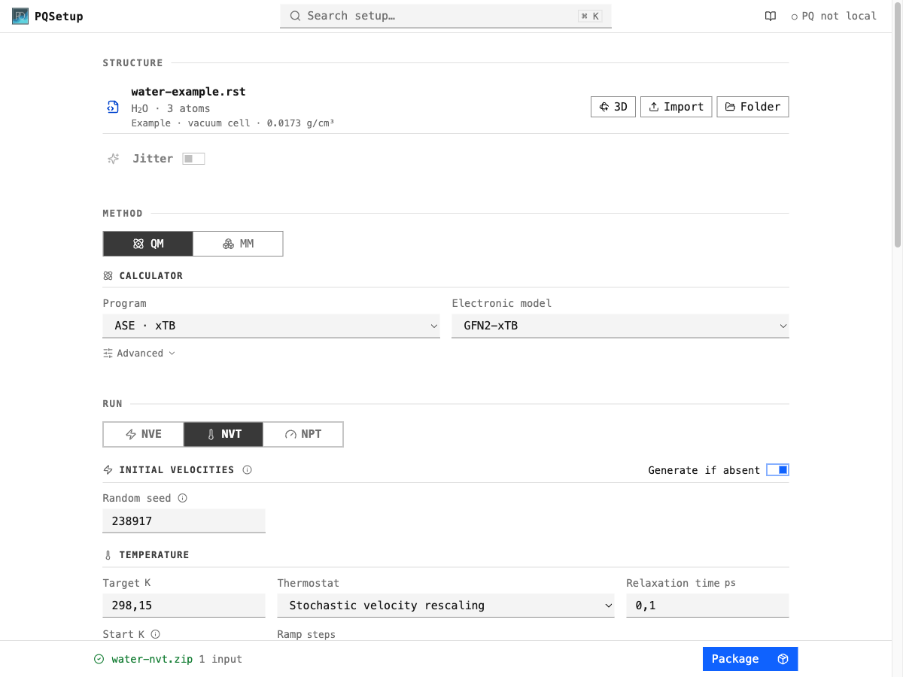

.. _overview:

PQSetup
========

Prepare, inspect, and package PQ simulation inputs in a local browser.

   Structure, method, run conditions, and output follow one top-to-bottom
   workflow.

Start
-----

.. code-block:: bash

   python3 -m venv .venv
   source .venv/bin/activate
   python -m pip install MolarVerse-PQSetup
   pqsetup

Python 3.11 or newer is required. The interface is included in the package.

Three steps
-----------

#. Import a structure, choose QM or MM, and add the required method files.
#. Set the ensemble, coupling, timestep, length, and optional equilibration.
#. Review the scientific plan and generated PQ inputs, then package the run.

The bundled water system is a short vacuum example. Replace its structure,
model, cell, and run length before research use.

Manual
------

.. list-table::
   :header-rows: 1
   :widths: 38 62

   * - Task
     - Page
   * - Install and create a first package
     - :doc:`getting-started`
   * - Find a control in the interface
     - :doc:`workflow`
   * - Understand which checks ran
     - :doc:`validation`
   * - Check supported files, cells, and calculators
     - :doc:`reference/compatibility`
   * - Inspect advanced PQ keywords
     - :doc:`reference/settings`
   * - Run or transfer a package
     - :doc:`run-packages`
   * - Use PQSetup through SSH or VPN
     - :doc:`remote-access`
   * - Resolve a blocked package or runtime problem
     - :doc:`troubleshooting`

.. note::

   PQSetup is pre-1.0. File and Python interfaces may change.

.. toctree::
   :hidden:
   :maxdepth: 2
   :caption: Contents

   getting-started
   remote-access
   workflow
   validation
   run-packages
   reference/cli
   reference/compatibility
   reference/settings
   troubleshooting
   design-system
   development
