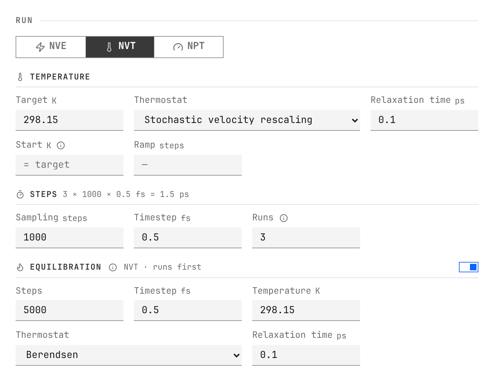
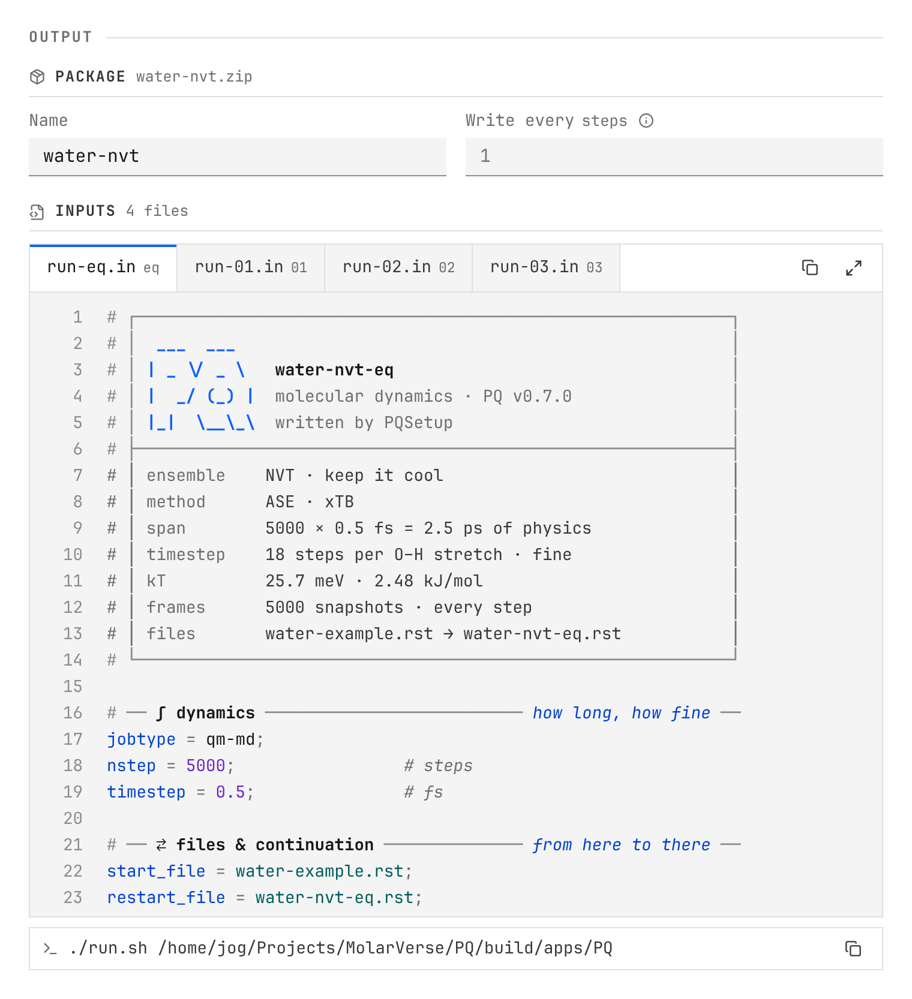

.. _workflow:

Build a run
===========

PQSetup keeps the scientific setup in five visible steps. The preflight panel
updates as the structure, method, and protocol change.

1. System
---------

Import ``.rst``, ``.cif``, ``.xyz``, ``.extxyz``, ``.pdb``, ``.mol``,
``.sdf``, or ``.traj``. For a multi-frame trajectory, PQSetup imports the
final frame.

The structure pass checks finite coordinates, element labels, the periodic
cell, and unusually close contacts. Periodic coordinates are wrapped to
fractional coordinates from −0.5 to +0.5. For an orthorhombic cell, that is
−L/2 to +L/2. The original file is not modified.

Structures without a cell receive an orthorhombic cell with 6 Å of padding on
each side. That generated cell is a convenient vacuum boundary, not a claim
that the chosen dimensions are physically converged.

2. Method
---------

Choose one interaction model:

* **Molecular mechanics** with GUFF, bonded plus GUFF, or a classical force
  field and the required topology or parameter files.
* **QM molecular dynamics** with one supported external calculator and any
  required templates.

PQSetup checks whether the selected calculator appears available in the
current environment. This is a discovery check, not an energy or force
calculation. A portable package can still be prepared for another machine when
the local calculator is absent.

3. Conditions
-------------

Sampling can use NVE, NVT, or NPT. Temperature coupling, pressure coupling
(``manostat`` in PQ), timestep, target conditions, and run length remain
editable.

Add an optional NVT equilibration stage, then write sampling as one input or a
numbered restart chain. Every later input reads the previous restart.

   An equilibration restart followed by three continued sampling inputs.

.. admonition:: Why PQ says manostat

   PQ uses *manostat* for the pressure-coupling algorithm. It is essentially
   the component most molecular-dynamics programs call a *barostat*.

4. Prepare
----------

Periodic atoms stay wrapped in PQ's centered-cell convention. For a perfect
crystal, an optional seeded Gaussian position perturbation can break exact
symmetry. The same seed reproduces the same coordinates.

Velocity initialization is performed by PQ at runtime. PQSetup writes the
temperature and random seed; PQ samples the mass-dependent velocities and
removes net motion.

5. Review
---------

Review the run name, structure name, execution order, continuation files, and
the complete text of every generated input. Errors block package creation;
warnings remain visible and are recorded in the project manifest.

   The restart relationship and final PQ input are visible before export.

The exported input header identifies PQSetup and the target PQ release. It is
designed to make provenance obvious without obscuring the settings that
matter.

Search and shortcuts
--------------------

.. list-table::
   :header-rows: 1
   :widths: 65 35

   * - Action
     - Shortcut
   * - Search settings and actions
     - :kbd:`Ctrl+K` / :kbd:`Cmd+K`
   * - Jump to workflow step
     - :kbd:`Alt+1` … :kbd:`Alt+5`
   * - Create the package
     - :kbd:`Ctrl+Enter` / :kbd:`Cmd+Enter`
   * - Close search
     - :kbd:`Esc`
